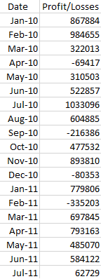
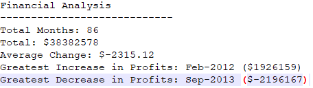

# Bank Budgetary Analyzer

## Sole Author

Ashley Sligh

## Programming Language/Tools Applied: 

Python, VS Code, CSV

## Purpose

The purpose of the PyBank application is to analyze monthly budgetary financial data and produce statistical results to both the terminal at to text file using a scaleable, object-oriented approach.

## Instructions

To run the PyBank program perform the following steps:
1) Download the project to your local machine
2) Open a Bash session and CD to the folder location
3) Type "Code ." to launch VS Code
4) Click the "Run" button to launch the program
5) Results written to the analysis/budget_data_analysis.txt path

## Illustrative Input Data Sample

## Illustrative Data Output

